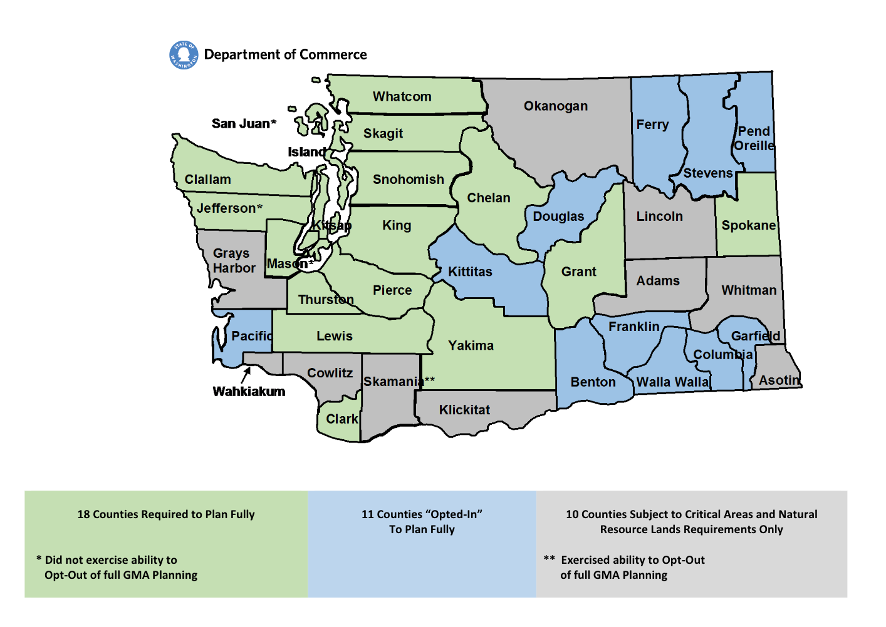

## Washington - Planning & Zoning Scorecard

### State Planning

#### State Planning Capacity

1.  **YES**
2.  Department of Commerce, Growth Management Services (GMS):
    - Has a mission ["to assist and guide local governments, state agencies, and others to manage growth and development, consistent with the Growth Management Act"](http://www.commerce.wa.gov/serving-communities/growth-management/) (GMA)

####  State Plan for Agriculture

1.  **YES**
2.  Dept. of Ag. published The Future of Farming, ["a statewide strategic plan for Washington agriculture submitted to the Legislature and the Governor in February 2009.”](https://agr.wa.gov/fof/)

#### State Planning Goals Relate to Agriculture

1.  **YES**
2.  [ RCW 36.70A.011](http://apps.leg.wa.gov/rcw/default.aspx?cite=36.70A.011):

    >Finally, the legislature finds that in defining its rural element under RCW 36.70A.070(5), a county should foster land use patterns and develop a local vision of rural character that will: […] permit the operation of rural-based agricultural, commercial, recreational, and tourist businesses that are consistent with existing and planned land use patterns.

3.  [RCW 36.70A.020](http://apps.leg.wa.gov/rcw/default.aspx?cite=36.70a.020):
    > The following goals are adopted to guide the development and adoption of comprehensive plans and development regulations of those counties and cities that are required or choose to plan under RCW  36.70A.040
    >
    > […]
    >
    > (8) Natural resource industries. Maintain and enhance natural resource-based industries, including productive timber, agricultural, and fisheries industries. Encourage the conservation of productive forestlands and productive agricultural lands, and discourage incompatible uses

#### State provides grants or technical assistance to support development of local comprehensive plans or farmland protection plans.

1.  **YES**
    - GMS:
      -  Offers direct assistance and grants related to GMA compliance. The GMA requires designated counties to develop and implement comprehensive plans that meet standards set forth by statute.
      - Publishes and updates a local planning guidebook
      - Organize the Regional Planners’ Forums, in coordination with Planning Association of Washington and the Washington Chapter of the American Planning Association.
      - Runs “short courses on local planning.”
          - Course offers:
              - An overview of the complex mix of land use planning laws that work together to support land-use decision-making in Washington state;
              - An introduction to comprehensive planning and plan implementation under the Growth Management Act;
              - A review of the roles in planning and best practices for public participation; and
              - Mandatory training on the Open Public Meetings Act for local government officials.
              - All courses are offered at no charge and are open to the public.
          - Perhaps follow up on how frequently the courses are offered. Only two times/locations listed for 2017.

#### State tracking of local plans

1.  **YES**
2.  Department of Commerce tracks county planning status (e.g. required to “fully plan,” opting to “fully plan,” not fully planning) under the WA Growth Management Act.
  

3.  [They also track compliance](http://www.commerce.wa.gov/serving-communities/growth-management/submitting-materials/):
    > Counties and cities must be in compliance with the requirements of the GMA, including the periodic update requirements, to be eligible for grants and loans from certain state infrastructure programs. To help applicants and funding programs implement this requirement, Growth Management Services maintains a list of local governments that are in compliance. When you take legislative action that meets your update requirement, make sure you send the adopting ordinance or legislation to Commerce, clearly identifying it as part of the update. This will allow Commerce to keep information about your city or county complete and up to date.
4.  [A PDF of community compliance status is publicly available](https://deptofcommerce.app.box.com/s/sb93d6i4jn7u9j91wknr7dghxffrabk4)

#### State planning goals related to compact development/smart growth

1. **YES**
2. [RCW 36.70A.020](http://apps.leg.wa.gov/rcw/default.aspx?cite=36.70a.020):
    > The following goals are adopted to guide the development and adoption of comprehensive plans and development regulations of those counties and cities that are required or choose to plan under RCW 36.70A.040.
    >
    > [...]
    >
    > 2.  Reduce sprawl. Reduce the inappropriate conversion of undeveloped land into sprawling, low-density development.”

3. Only certain counties are required to adopt comprehensive plans under RCW 36.70A.040 (see local planning items).

---

### Local Planning

#### Requires localities to develop comprehensive plans

1. **YES**
2. Under [RCW 36.70A.040](http://app.leg.wa.gov/rcw/default.aspx?cite=36.70a.040),  counties that meet the following criteria must adopt a comprehensive plan that conforms with the standards set forth by the Growth Management Act:
    1. A county that had both a population of 50,000 or more and population increase of ten percent or more from 1985-1995,
    2. Or a county whose population increased by more than 20 percent in 10 years
    3. Or a county that voluntarily elects to plan under the GMA.
2. 29 Counties “fully planning.” 10 subject to Critical Areas and Natural Resource Lands requirements only.
3. Cities and towns within fully planning counties must adopt comprehensive plans. Fully planning counties also adopt county-wide planning policies.

#### Require localities to address agricultural issues in their local plans
1. **YES**
2. According to [RCW 36.70A.060 (2)](http://app.leg.wa.gov/rcw/default.aspx?cite=36.70a.060), all counties and cities "shall adopt development regulations that protect "critical areas.” Critical area include "Agricultural lands that are not already characterized by urban growth and that have long-term significance for the commercial production of food or other agricultural products” [(RCW 36.70A.170 a)](https://app.leg.wa.gov/rcw/default.aspx?cite=36.70A.170)

#### Require localities to protect agricultural resources in their local plans

1. **YES**
2. See above.
3. [According to WA Growth Management Services:](http://www.commerce.wa.gov/serving-communities/growth-management/growth-management-topics/natural-resource-lands/)
    >All jurisdictions in Washington state need to determine where natural resource industries, including forestry, agricultural, mining, and fisheries industries, can productively operate, and use land-use controls to designate and conserve the necessary lands and to avoid conflicts with these industries from other land uses.

#### Require localities to support compact/efficient development in designated growth areas

1. **YES**
2. [RCW 36.70A.110.1](http://app.leg.wa.gov/rcw/default.aspx?cite=36.70a.110):
    >Each county that is required or chooses to plan under RCW  36.70A.040 shall designate an urban growth area or areas within which urban growth shall be encouraged and outside of which growth can occur only if it is not urban in nature

3. Protection of “critical area” (e.g. farmland), is closely linked with designation of urban growth areas. According to the Puget Sound Growth Management Hearings Board:
    >Two of the Act's most powerful organizing concepts to combat sprawl are the identification and conservation of resource lands and the protection of critical areas (see RCW 36.70A.060 and .170) and the subsequent setting of urban growth areas (UGAs) to accommodate urban growth (see RCW 36.70A.110). It is significant that the Act required cities and counties to identify and conserve resource lands and to identify and protect critical areas before the date that IUGAs had to be adopted. This sequence illustrates a fundamental axiom of growth management: "the land speaks first." Only after a county's agricultural, forestry and mineral resource lands have been identified and actions taken to conserve them, and its critical areas, including aquifers, are identified and protected, is it then possible and appropriate to determine where, on the remaining land, urban growth should be directed pursuant to RCW 36.70A.110.30.
