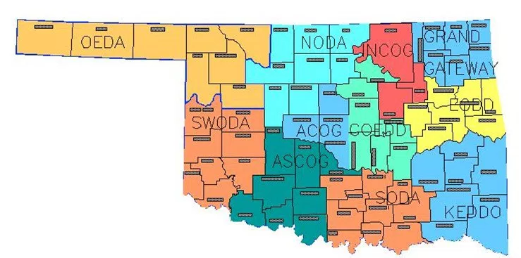

## Oklahoma - Planning & Zoning Scorecard

### State Planning

#### State Planning Capacity

**NEED TO CONFIRM**

1.  No state entity has the capacity or mission to engage in land use planning.
2.  A statewide network of COGS does exist:

    

    The [Oklahoma Association of Regional Councils](http://oarcok.org/about/history/) does list comprehensive planning as a program area, but it is unclear whether *all* COGS engage in planning activities and how those activities are funded. Need to confirm.

####  State Plan for Agriculture

**NO**

1.  No state entity has published either a plan for agriculture or a food systems plan.

#### State Planning Goals Relate to Agriculture

**NO**

1.  No state statute or official publication established planning goals related to agriculture.

#### State provides grants or technical assistance to support development of local comprehensive plans or farmland protection plans.

**NEED TO CONFIRM**

1.  According to the History section of the [Oklahoma Association of Regional Councils website](http://oarcok.org/about/history/), COGs once provided significant technical assistance on local comprehensive plans, but, today, assistance is much more limited:

    >Federal law provided the initial impetus for creating regional councils. The national legislation authorized organizations directed by local elected officials to prepare a variety of regional plans at the sub state level. In their early years, regional councils were heavily involved in comprehensive planning, with funding provided by the U.S. Department of Housing and Urban Development (HUD). However, these funds were significantly reduced in 1982. Regional councils continue to do comprehensive planning, however, with funding provided from local funds, state assistance, EDA and special contributions; projects now include regional data collection and analysis, mapping, and coordination of environmental, economic, social program plans, Rural Fire Defense, Capital Improvements Plan (CIP), Rural Economic Action Plan (REAP) Grant programs and Hazard Mitigation Planning.

    I need to confirm with OARC, or an individual COG, whether state funds are still available for comprehensive planning, or if assistance is rendered on a fee-for-service basis.

#### State tracking of local plans

**NO**

1.  No state entity has the mandate or capacity to track local comprehensive plans

#### State planning goals related to compact development/smart growth

**NO**

1.  No state statute or official publication established planning goals related to smart growth. The Oklahoma Planning Commissioner's Handbook (2007), published by APA-OK, does list smart growth as a best practice.

---

### Local Planning

#### Requires localities to develop comprehensive plans

**NO**

1.  From the [Oklahoma Planning Commissioner's Handbook](http://www.okplanning.org/assets/PC_Handbook_with_Bookmarks_10-31-07.pdf), published by the OK chapter of the APA:
    > In Oklahoma, there are no statewide mandates to plan such as the states of Florida and Georgia have. The Oklahoma Legislature enacted legislation in 1923, which established the scope, procedures, and limitations for planning for the cities and towns in the state. This grant of authority is set forth in Section 401 425 of Title 11 of the Oklahoma Statutes. This legislation authorized the establishment of a city planning commission and a zoning commission, but provided that when a city planning commission existed, it should also act as the zoning commission. The planning commission was granted authority to hire staff and conduct planning work within the municipality (Section 865.51 of Title 19 of the Oklahoma Statutes similarly authorizes county planning commissions and boards of adjustment).

#### Require localities to address agricultural issues in their local plans

**NO**

1.  §11-43-103 of Oklahoma State Statute, "Purpose of Regulations - Comprehensive Plan," states that "municipal regulations as to buildings, structures and land shall be made in accordance with a comprehensive plan and be designed to accomplish any of the following objectives":
    > 1.  To lessen congestion in the streets;
    > 2.  To secure safety from fire, panic and other dangers;
    > 3.  To promote health and the general welfare, including the peace and quality of life of the district;
    > 4.  To provide adequate light and air;
    > 5.  To prevent the overcrowding of land;
    > 6.  To promote historical preservation;
    > 7.  To avoid undue concentration of population; or
    > 8.  To facilitate the adequate provision of transportation, water, sewerage, schools, parks and other public requirements.

    Interesting to note that the APA-OK Planning Guide, while advocating that zoning ordinance should always stem from a comprehensive plan, does not explicitly mention the *statutory* mandate that development regulations be made "in accordance with a comprehensive plan."
2.  Title 19 of Oklahoma State Law similarly does not *require* a county or metropolitan county plan contain any particular content.

#### Require localities to protect agricultural resources in their local plans

**NO**

1.  See above.

#### Require localities to support compact/efficient development in designated growth areas

**NO**

1.  See above *suggested* components of a comprehensive plan. If anything, suggested comprehensive plan components, e.g. "avoid undue concentration of population," *encourage* sprawl.
