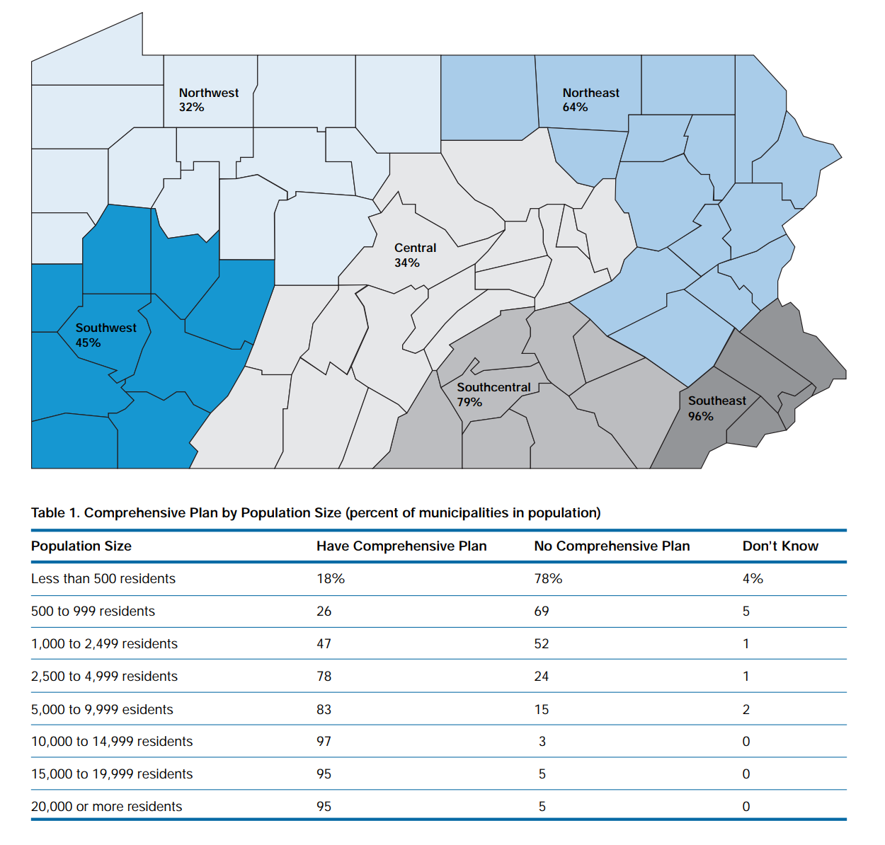

## Pennsylvania - Planning & Zoning Scorecard

### State Planning

#### State Planning Capacity

**YES**

1.  Pennsylvania has a [State Planning Board](http://dced.pa.gov/local-government/boards-committees/state-planning-board/). It is an
    > advisory board within the Governor’s Office. It was established by the Administrative Code of 1929 as re-enacted and amended. There are 25 members, including citizens, legislators and state department heads.

    The Board

    > works with DCED to prepare the State Land Use and Growth Management Report every five years. The report studies development patterns and local government land use planning, and makes recommendations for state agency action, regulations, and programs.

    Board membership consists of gubernatorial and legislative appointees, as well as cabinet secretaries.

2.  The PE Dept. of Community and Economic Development has a [Community Planning Section](http://dced.pa.gov/housing-and-development/community-planning/), which work collaboratively with the State Planning Board and provides assistance to local jurisdictions.
3. The PE Dept. of Environmental Protection also

####  State Plan for Agriculture

#### State Planning Goals Relate to Agriculture

**YES**

1.  Section 105 of the PE Municipalities Planning Code (MPC) includes preservation of prime agricultural land as a purpose of the act:

    >   It is the intent, purpose and scope of this act to protect and promote safety, health and morals; to accomplish coordinated development; to provide for the general welfare by guiding and protecting amenity;
    [...]
    to promote the preservation of this Commonwealth’s natural and historic resources and **prime agricultural land**;
    [...]
    to encourage the preservation of prime agricultural land and natural and historic resources through easements, transfer of development rights and rezoning; to ensure that municipalities enact zoning ordinances that facilitate the present and future economic viability of existing agricultural operations in this Commonwealth and do not prevent or impede the owner or operator’s need to change or expand their operations in the future in order to remain viable;

#### State provides grants or technical assistance to support development of local comprehensive plans or farmland protection plans.

**YES**

1.  The Governor’s Center for Local Government Services trains local government officials through the PA Local Government Training Partnership, which
    >is a strategic and collaborative initiative on behalf of the six major local government associations: PA State Association of Township Supervisors (PSATS), PA State Association of Boroughs (PSAB), PA State Association of Township Commissioners (PSATC), County Commissioners Association of PA (CCAP), PA Municipal League (PML) and PA Municipal Authorities Association (PMAA).

    The Training Partnership offers courses that cover land use planning.

2.  Penn State Extension offers [webinars](http://extension.psu.edu/community/ecd/courses/land-use-planning) and other resources on land use planning and decision-making.
3. Section 301.5 of the PE MPC prioritizes the award of state planning grants to municipalities who agree to harmonize municipal comprehensive plans with respective county comprehensive plans:

    >Priority for state grants to develop or revise comprehensive plans shall be given to those municipalities which agree to adopt comprehensive plans generally consistent with the county comprehensive plan and which agree to enact a new zoning ordinance or amendment which would fully implement the municipal comprehensive plan. No more than 25% of the total funds available for these grants shall be disbursed under priority status pursuant to this provision. Municipalities and counties shall comply with these agreements within three years. Failure to comply with the agreements shall be taken into consideration for future state funding.

#### State tracking of local plans

1.  Penn State Agriculture Extension conducted a [land use survey](http://extension.psu.edu/publications/ua350) in 1999, which covered both comprehensive plans and zoning ordinance.

    

#### State planning goals related to compact development/smart growth

---

### Local Planning

#### Requires localities to develop comprehensive plans

**PARTIAL**

1.  Local governments are authorized, but not required, to create a planning commission or planning department. If a planning agency is created, then it "shall be required to":

    >Prepare the comprehensive plan for the development of the municipality as set forth in this act, and present it for the consideration of the governing body. (MPC Section 209.1 (a)(2))

2.  Counties with comprehensive plans:
    >are required to update the comprehensive plan every ten years.

    Whereas
    >municipal and multimunicipal plans are to be reviewed at least every 10 years and at that time sent to contiguous municipalities for review and comment. (Governor's Center for Local Government Services, Planning Series #3, pg. 3)

#### Require localities to address agricultural issues in their local plans

**PARTIAL**

1.  Towns and cities are not required to address agriculture in their   comprehensive plan. According to PE MPC Section 301:
    >(a) The municipal, multimunicipal or county comprehensive plan, consisting of maps, charts and textual matter, shall include, but need not be limited to, the following related basic elements:
    > * (2) A plan for land use, which **may include** provisions for the amount, intensity, character and timing of land use proposed for residence, industry, business, agriculture, major traffic and transit facilities, utilities, community facilities, public grounds, parks and recreation, **preservation of prime agricultural lands**, flood plains and other areas of special hazards and other similar uses.

2.  Counties, however *are required* to establish an agricultural preservation plan as part of their comprehensive plans. According to MPC Section 301 (7)(iii), a county comprehensive plan shall:

    >Identify a plan for the preservation and enhancement of prime agricultural land and encourage the compatibility of land use regulation with existing agricultural operations.

#### Require localities to protect agricultural resources in their local plans

**PARTIAL**

1.  See above. Counties must include an agricultural preservation plan as part of their comprehensive plan.

#### Require localities to support compact/efficient development in designated growth areas

**NO**

1.  PE MPC authorizes, but does not require "intergovernmental cooperative agreements" to :

    > designate growth areas, future growth areas and rural resource areas within the plan. The agreement shall also provide a process for amending the multimunicipal comprehensive plan and redefining the designated growth area, future growth area and rural resource area within the plan. (MPC Section 1104 (c))

    Intergovernmental cooperative agreements allow municipalities and counties to create and maintain multimunicipal comprehensive plans.
