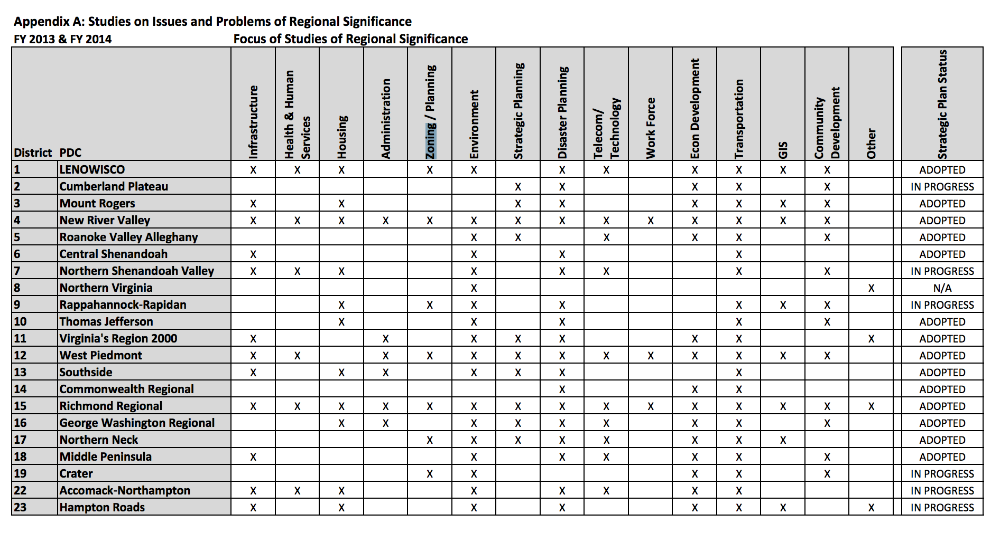
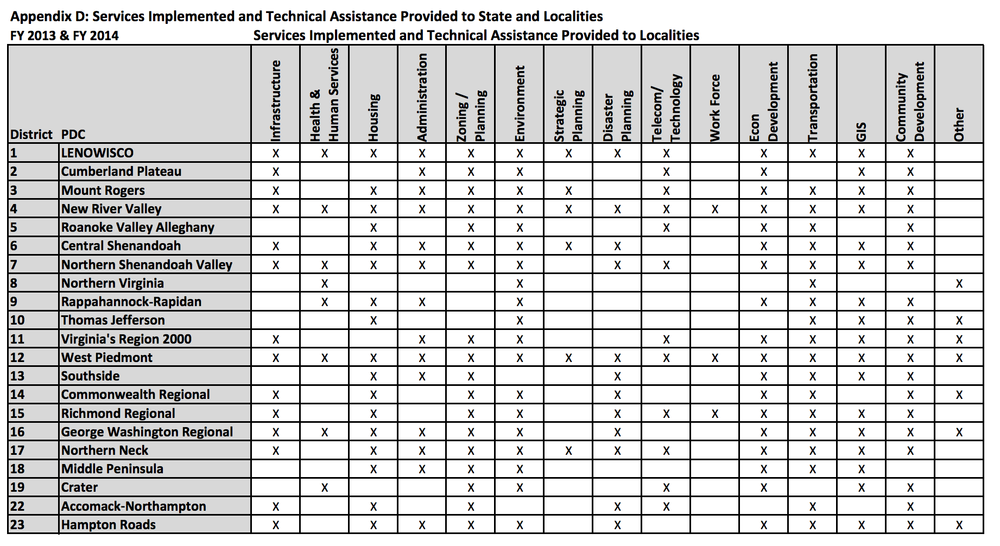

## Viginia - Planning & Zoning Scorecard

### State Planning

#### State Planning Capacity

**NO**

1.  State-level planning came to an end after the Division of State Planning and Community Affairs was disbanded in the mid-1970s and some of its duties distributed to other agencies. [(History of Virginia Planning District Commissions)](http://c.ymcdn.com/sites/www.vapdc.org/resource/resmgr/imported/Final%20History%20of%20the%20Virginia%20Planning%20District%20Commissions.pdf)
2.  VA Dept. of Housing and Community Development
    - does not offer planning programs/technical assistance.
    - It does however, provide a small amount of funding to the state's 21 planning districts. (IN FY17, each planning district received an average of $85k in monies appropriated by the legislature). Local membership in PDC's is strictly voluntary.
    - Planning districts receiving funding are required to submit an annual report to the Department of Housing and Community Development.
    - Federal funding, however, is "by far" the largest funding source of PDs.
    - Not all PD's work consistently on planning and zoning issues. For instance, see the below chart of PD study areas for FY13 & 14. Less the half of PDs worked on planning and zoning issues.

    

    - Planning Districts not under the aegis of multi-state planning councils of government are required by statute to create a regional strategic plan, which shall:
      >concern those elements which are of importance in more than one of the localities within the district, as distinguished from matters of only local importance. The plan shall include regional goals and objectives, strategies to meet those goals and objectives and mechanisms for measuring progress toward the goals and objectives. The strategic plan shall include those subjects necessary to promote the orderly and efficient development of the **physical**, social and economic elements of the district such as transportation, housing, economic development and environmental management.
      >
      >§ 15.2-4209

      A cursory examination of some PDC strategic plans, however, reveals that they do not necessarily focus on planning and zoning issues.

    - VA State Code § 15.2-4209 (C) requires that PDC's submit strategic plans to DHCD for review. Statute directs DHCD to notify the submitting PDC whether its strategic plan conflicts with those of adjacent planning districts.
    - Statute directs PDCs to submit adopted strategic plans to DHCD "for information and coordination purposes" (§ 15.2-4209 (E))
    - Because of diminished state funding in the late 80's through the early 90's, PDCs
      >lost sight of comprehensive planning and began to focus upon other tasks for which they had received funding. The programs offered had shifted from regional planning efforts to service delivery, at a time when the Commonwealth needed excellent regional planning
      >
      >*A History of PDCs* - Virginia Association of PDCs

2.  THe Dept. of Ag's Farmland Preservation program works on PDR and conservation easement issues, but not comprehensive planning or general land use regulations.
3.  The VA Dept. of Planning and Budget provides guidance to state agencies and the governor on fiscal, legistlative, and regulatory policies. They do not work on land use or comprehensive planning.

####  State Plan for Agriculture

**NO**

1.  No state entity has published a farm action plan or food systems plan. State government, through its land grant university extensions services, did contribute to the [Virginia Farm to Table Plan](https://pubs.ext.vt.edu/content/dam/pubs_ext_vt_edu/CV/CV-3/CV-3_lowrez_pdf.pdf). The plan focuses more on farm viability and food access than farmland preservation, but does address farmland preservation:
    > In collaborating to implement this Plan, we will grow jobs and
new entrepreneurs, encourage durable economic development
around farming and food, maintain farmland and working
landscapes, improve public health, increase food security, and
strengthen community viability for a stronger local food system and brighter economic future.

#### State Planning Goals Relate to Agriculture

**NO**

1.  The state has no planning goals. Lower levels of government, along with regional planning districts, set planning and development objectives.

#### State provides grants or technical assistance to support development of local comprehensive plans or farmland protection plans.

**NO**

1.  Most PDC's provide technical assistance to member municipalities on planning and zoning issues (see chart below), but these services are not funded by earmarked state monies.

  

#### State tracking of local plans

**NO**

1.  No state entity tracks local plans. At least some PDCs have developed databases of local planning documents (e.g. Thomas Jefferson Planning District Commission)

#### State planning goals related to compact development/smart growth

**NO**

1.  The state has no planning goals. Lower levels of government, along with regional planning districts, set planning and development objectives. Arlington County, for example, has [worked extensively](https://projects.arlingtonva.us/planning/smart-growth/) on smart growth issues.

---

### Local Planning

#### Requires localities to develop comprehensive plans

**YES**

1.  Every locality must create a local planning commission (Stat. Code § 15.2-2210). Every planning commission, in turn,

    > shall prepare and recommend a comprehensive plan for the physical development of the territory within its jurisdiction and every governing body shall adopt a comprehensive plan for the territory under its jurisdiction.
    >
    > VA State Code § 15.2-2223

#### Require localities to address agricultural issues in their local plans

**NO**

1.  According to [VA State Code § 15.2-2223 ](https://vacode.org/15.2-2223/), the only mandatory component of a comprehensive plan is the locality's transportation plan. The comprehensive plan "may include":

    >The designation of areas for various types of public and private development and use, such as different kinds of residential, including age-restricted, housing; business; industrial; **agricultural**; mineral resources; conservation; active and passive recreation; public service; flood plain and drainage; and other areas;
    >
    > VA State Code § 15.2-2223 (C)(1)

#### Require localities to protect agricultural resources in their local plans

**NO**

1.  See above

#### Require localities to support compact/efficient development in designated growth areas

**NO**

1.  See above
